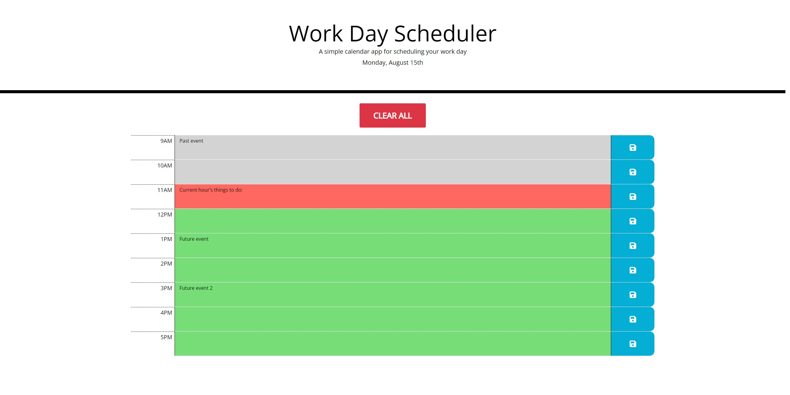

# Work Scheduler Challenge

## Contents
This is Adrian Jimenez's module 5 work scheduler challenge submission.

I started off approaching this similarly to how I did the password generator challenge in the sense that I first created a constructor function to create and display the elements I wanted on the page. After looking at jQuery and Moment.js's documentation, I was able to use the syntax of both libraries to display the current date on the page, and generate rows containing standard business hours. I generated these rows to be formatted using Bootstrap classes, as well as certain id's and classes I could use for referencing the elements later. Afterwards, I added the saving and loading logic into functions, using a similar localstorage implementation as I had before in other projects. The main difference is that my content loading function in this project sets the values of the rows constructed to the data stored in row object in the tasks array stored in local storage. In previous implementations I'd called a constructor function from the content loading function to reconstruct the elements with the new text values. Lastly, I added a clear button for user convenience.

The finished product displays the current date and highlights time blocks based on whether they are in the past, present, or future. Text can be entered into the time blocks, and saved via the save icons. The saved text will then persist even if the page is reloaded.

## Built With
* HTML
* CSS
* JavaScript
* Bootstrap
* Moment.js
* JQuery

## Preview

## Website
https://puppetaj.github.io/05-Scheduler-AJ/

## Credits
Made by Adrian Jimenez

## License

MIT License

Copyright ©️ 2022 Adrian Jimenez

Permission is hereby granted, free of charge, to any person obtaining a copy
of this software and associated documentation files (the "Software"), to deal
in the Software without restriction, including without limitation the rights
to use, copy, modify, merge, publish, distribute, sublicense, and/or sell
copies of the Software, and to permit persons to whom the Software is
furnished to do so, subject to the following conditions:

The above copyright notice and this permission notice shall be included in all
copies or substantial portions of the Software.

THE SOFTWARE IS PROVIDED "AS IS", WITHOUT WARRANTY OF ANY KIND, EXPRESS OR
IMPLIED, INCLUDING BUT NOT LIMITED TO THE WARRANTIES OF MERCHANTABILITY,
FITNESS FOR A PARTICULAR PURPOSE AND NONINFRINGEMENT. IN NO EVENT SHALL THE
AUTHORS OR COPYRIGHT HOLDERS BE LIABLE FOR ANY CLAIM, DAMAGES OR OTHER
LIABILITY, WHETHER IN AN ACTION OF CONTRACT, TORT OR OTHERWISE, ARISING FROM,
OUT OF OR IN CONNECTION WITH THE SOFTWARE OR THE USE OR OTHER DEALINGS IN THE
SOFTWARE.
